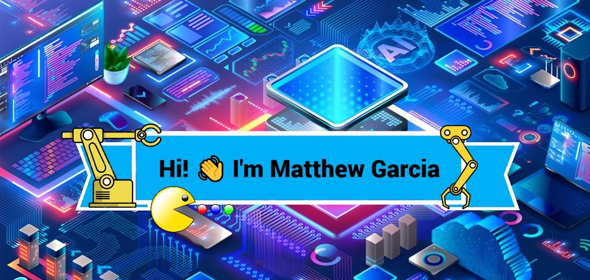

<!-- Banner -->

<!-- Header Name -->
#  ʜɪ, ɪ'ᴍ ᴍᴀᴛᴛʜᴇᴡ ɢᴀʀᴄɪᴀ!  
*Aspiring Computer Engineer | Hardware & Software Craftsman*  
 

---

I am a **Computer Engineering Student** passionate about **Robotics**, **Embedded Systems**, and **Hardware Development**. I love exploring how hardware and software integrate to build innovative solutions.

• ✨ **Eternal Learner**: I believe every day is an opportunity to grow.  
• 🌱 **Currently Learning**: Deepening my knowledge in VHDL, robotics, and advanced coding techniques.  
• 🤖 **Robotics Enthusiast**: Working on projects to automate and innovate.  
• 💻 **Skills**: C++, Python, VHDL, MATLAB, Embedded Systems, Arduino, and ROS.  

---

<!--Languages and Tools Section-->       
<h2 align="center">Tᴇᴄʜ Sᴛᴀᴄᴋ & Tᴏᴏʟs</h2>

  

  <h3>Languages & Tools</h3>
  

    
    
    
    
    
    
    
    
  

  <h3>Software & Platforms</h3>
  

    
    
    
    
    
  

---

## 🛠️ **Explore My Projects**

Check out my projects [here](./PROJECTS.md)! 🚀

---

### 🌟 **Connect with Me**
- 📫 **Email**: [garciamatthew176@gmail.com](mailto:garciamatthew176@gmail.com)  
- 💼 **LinkedIn**: [Matthew Garcia](https://www.linkedin.com/in/matthew-garcia-165634195/)  
- 🚀 **Portfolio**: Coming soon!  

---

Let’s innovate and build the future together! 🚀

