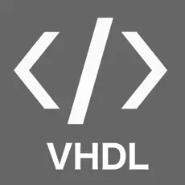

<!-- Banner -->

<!-- Header Name -->
#  ʜɪ, ɪ'ᴍ ᴍᴀᴛᴛʜᴇᴡ ɢᴀʀᴄɪᴀ!  
*Aspiring Computer Engineer | Hardware & Software Craftsman*  
 

---

I am a **Computer Engineering Student** passionate about **Robotics**, **Embedded Systems**, and **Hardware Development**. I love exploring how hardware and software integrate to build innovative solutions.

• ✨ **Eternal Learner**: I believe every day is an opportunity to grow.  
• 🌱 **Currently Learning**: Deepening my knowledge in VHDL, robotics, and advanced coding techniques.  
• 🤖 **Robotics Enthusiast**: Working on projects to automate and innovate.  
• 💻 **Skills**: C++, Python, VHDL, MATLAB, Embedded Systems, Arduino, and ROS.  

---

<!--Languages and Tools Section-->       
<h2 align="center">Tᴇᴄʜ Sᴛᴀᴄᴋ & Tᴏᴏʟs</h2>

  

  <h3>Languages & Tools</h3>
  

    
    
    
    
    
    
    
    
    
    
    
  

  <h3>Software & Platforms</h3>
  

    
    
    
    
    
  

---

## 🛠️ Projects

### 🤖 [SCARA Robot: A Robotic Arm for Precision Automation](https://github.com/yourusername/scara-robot)
The **SCARA Robot** (Selective Compliance Assembly Robot Arm) is a project focused on creating a robotic arm capable of precise and efficient automation for industrial tasks.

https://github.com/user-attachments/assets/4396a919-2353-4b3c-89cc-b7407e035c21

- **Features**:
  - Precision movement for high-accuracy positioning.
  - Integrated sensors for real-time feedback.
  - Path planning algorithms for motion optimization.
  - ROS2 integration for real-time monitoring and control.

- **Technologies Used**:
  - **Languages**: Python, C++
  - **Tools**: ROS2, Gazebo Simulator, Arduino IDE
  - **Hardware**: Servo Motors, Microcontroller (Arduino/STM32), Sensors

---

### 🐾 [Intelligent Pet Care: Enhancing Autonomous Pet Feeding with the Smart Bowl System](https://github.com/yourusername/intelligent-pet-care)
A smart pet bowl system that automates feeding schedules and tracks pet eating habits using sensors and microcontrollers.

- **Features**:
  - Automated portion control and feeding schedules.
  - Notifications for refill and maintenance needs.
  - User-friendly design for seamless interaction.

- **Technologies Used**:
  - **Languages**: Python, C++
  - **Tools**: Arduino IDE, Embedded C
  - **Hardware**: Weight sensors, Microcontroller, Servo motors

---

### 🐼 [Panda Robot: Advanced Motion Control System](https://github.com/yourusername/panda-robot)
The **Panda Robot** project involves developing an advanced robotic arm capable of performing intricate and precise movements for industrial and research applications.

https://github.com/user-attachments/assets/d567da86-3c32-45c8-9000-5579d1245e2d

- **Features**:
  - Advanced kinematics for precise joint control.
  - Integrated vision system for object detection and interaction.
  - Real-time motion planning and control with ROS.

- **Technologies Used**:
  - **Languages**: Python, C++
  - **Tools**: ROS2, MoveIt, Gazebo Simulator
  - **Hardware**: Panda robotic arm model, Cameras, and Sensors

---

### 🌟 **Connect with Me**
- 📫 **Email**: [garciamatthew176@gmail.com](mailto:garciamatthew176@gmail.com)  
- 💼 **LinkedIn**: [Matthew Garcia](https://www.linkedin.com/in/matthew-garcia-165634195/)  
- 🚀 **Portfolio**: Coming soon!  

---

Let’s innovate and build the future together! 🚀

